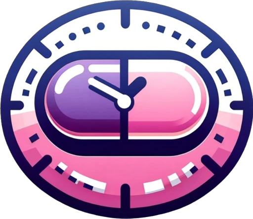

<h1 style="display: inline">TakeMeds</h1>
A telegram bot to remind about taking meds on time!

## About 
This is a Telegram bot that you can use at https://t.me/takemedsBot  
You can also copy this project and adapt to something else!

## Set up the project
1. Clone the repo
2. Follow the instructions at https://www.prisma.io/docs/guides/deployment/edge/deploy-to-deno-deploy  
   to set up remote DB and generate Prisma Client for Deno.  
   <b>Note:</b> You will need to create a table at Supabase manually. 
3. Create a <b>.env</b> file at the root of the project and populate  
   with your variables. See the <b>.example.env</b> file.
4. Run `deno task generate`.
5. Run `deno task start`.
6. Done!

## Blog
You can follow my Telegram channel to read my thoughts as I am buiklding something,  
read and discuss some tech news, see memes... and so on...  
<b>Here:</b> https://t.me/nyanblog
